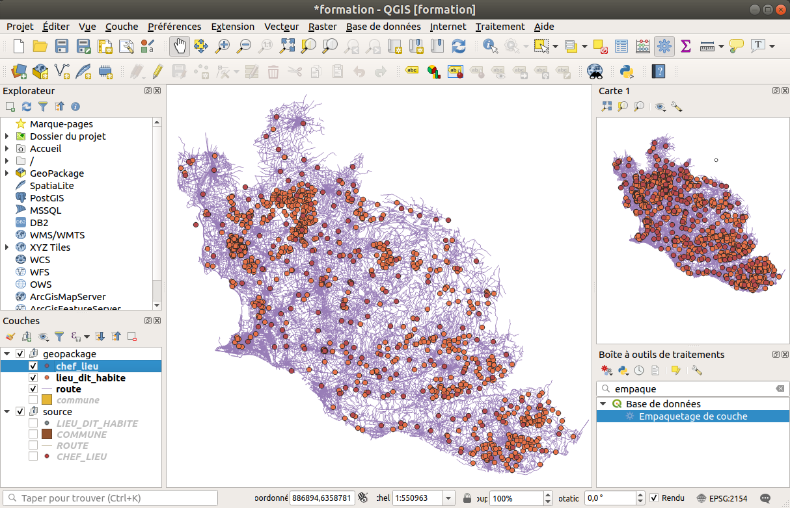
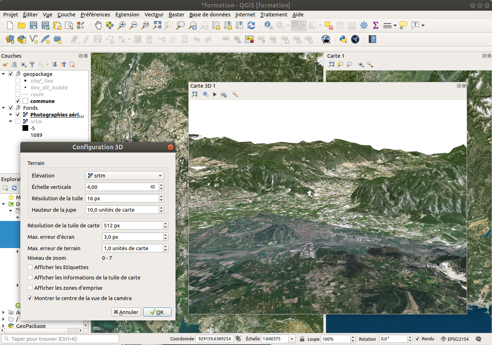

---
Title: Les couches
Favicon: logo.png
...

[Back](index.md)

[TOC]

# Ajout de couches et organisation de la légende

## Documentation officielle

* https://docs.qgis.org/3.10/fr/docs/user_manual/managing_data_source/index.html
* https://docs.qgis.org/3.10/fr/docs/user_manual/introduction/general_tools.html#label-legend

## Vecteurs

* À l'aide de l'icône `plus` dans la barre d'outil ci-dessus `Source de données`, ajoutons une couche `Vecteur` de type
`Fichier`. 
    * `H_OSM_ADMINISTRATIF / COMMUNE.shp`
* *Pour info*, dans les barres d'outils, les étoiles jaunes signifient la création de nouvelle couche. 
Dans notre cas, nous souhaitons donc bien l'ajout d'une couche existante.
* Enregistrer le projet `Projet` -> `Enregistrer sous...` et mettez le **dans** le dossier `data` contenant les données. 
au format `QGIS` (extension `.qgs`).
* Désormais, l'aide du panneau `Explorateur`, dans `Dossier du projet` :
    * Charger `A_OSM_RESEAU_ROUTIER / ROUTE.shp`
    * Charger `F_OSM_VEGETATION / ZONE_VEGETATION.shp`
    * Charger `H_OSM_ADMINISTRATIF / CHEF_LIEU.shp`
    * Charger `I_OSM_ZONE_ACTIVITE / PAI_INDUSTRIEL_COMMERCIAL.shp`
* Notons que le glisser/déposer fonctionne aussi.
* Nous pouvons faire un clic droit puis `Propriétés` pour ouvrir la configuration de la couche.

* Si il y a des problèmes d'accents, dans l'onglet `Source`, essayer :
    * `System`, `latin1`, `ISO 8859-1`, `CP-1252`
* Petites explications sur les encodages : 
    * `Unicode` :  jeu de caractères codés dit « universel » qui permet de remplacer les pages de codes nationales. 
    Comprend un répertoire très étendu de caractères compatible avec tous les alphabets. 
    Il est en évolution constante (une version en juin 2014) avec plus de 100 000 caractères.
    * `UTF-8` est le codage international le plus utilisé (en particulier sur le web) compatible avec Unicode.
    Il est supporté par tous les navigateurs web et par tous les systèmes d’exploitation récents. L’internationalisation
    et la portabilité 
    font naturellement recommander ce codage (Permet de représenter des caractères qui n’existent pas en latin-1). 
    * `ISO 8859-1` ou `Latin-1` : principalement utilisé par Windows pour les pays occidentaux, il intègre de nombreux 
    caractères spéciaux comme é, è, à, ç, É, etc, mais pas €,œ.
    * `CP-1252`  ou `WIN 1252` : extension d’ISO 8859-1 ; initié dans les années 1990, il ajoute quelques caractères 
    particuliers à Latin-1 comme €,œ, etc.
    * `ISO-8859-15` (ou latin9) est également très proche. Il ajoute au 88959-1 entre autres le caractère de l'euro (€) 
    et les caractères Œ, œ et Ÿ qui manquaient pour l'écriture du français, les caractères Š et š qui manquaient pour 
    l'écriture du tchèque. Il enlève en échange quelques caractères peu utilisés. 

* Source : http://www.geoinformations.developpement-durable.gouv.fr/qgis-encodage-des-fichiers-shp-et-recommandations-a2908.html

## Rasters

### Fichier MNT

**Pour rappel**, un fichier MNT veut dire Modèle Numérique de Terrain, c'est à dire un fichier comportant des informations
sur l'altitude.

* À l'aide du bouton `Source de données`,  ajouter la couche de type `Raster` contenu dans le dossier `srtm`.

### WMS de l'IGN

* À l'aide du bouton `Source de données`,  ajouter une connexion `WMS`:
    * Nom : `IGN WMTS`
    * URL : `https://wxs.ign.fr/choisirgeoportail/geoportail/wmts?SERVICE=WMTS&REQUEST=GETCAPABILITIES`
    Ajouter des flux provenant de l'IGN en utilisant cette clé gratuite `choisirgeoportail`.
    * Pour votre information : https://geoservices.ign.fr/blog/2018/09/06/acces_geoportail_sans_compte.html
    
### À l'aide d'un plugin

* À l'aide de l'extension `QuickMapServices` dans le gestionnaire des extensions Python.
* L'autre extension historique `OpenLayers` n'est pas forcément recommandée, surtout lors de l'impression.
* Dans sa configuration, cliquer sur le bouton `Obtenir le pack des contributeurs`.

### À l'aide du panneau explorateur

* Une couche de l'IGN
* Une couche XYZ

## Manipulation de la légende

Dans le panneau à gauche, vous remarquez la légende, avec sa barre d'outils.

### Utiliser les thèmes de couches

Un **thème de couche** est caractérisé par un **nom** et permet de sauvegarder:

* l'**état des couches cochées** dans la légende
* les **styles actifs** de chaque couche

**Étapes**:

* **Cocher/décocher** les couches pour obtenir le réglage souhaité
* Cliquer sur le bouton **oeil** de la barre d'outil au-dessus du panneau **Couches**
* Choisir l'item **Ajouter un thème**
* Choisir **un nom** et valider

Une fois un ou plusieurs thèmes enregistrés, on peut basculer facilement de l'un à autre thème via le bouton **oeil**.

Les thèmes peuvent être utilisés pour gérer les couches affichées **dans chaque vue**, ainsi que dans chaque carte de 
**chaque composeur d'impression**.

### Les vues cartes

QGIS3 propose d'afficher plusieurs canevas, appelés **vues carte**, au lieu d'une seule carte centrale.

* Menu **Vue / Nouvelle vue cartographique**
* On peut la faire **glisser dans l'interface**, par exemple dans le panneau de droite
* Par défaut, elle se comporte comme la carte principale: les **mêmes couches sont visibles**

## La vue 3D

La **vue 3D** permet de draper des données vectorielles ou raster par dessus un **modèle numérique de terrain** (MNT)

Elle peut aussi représenter des données qui ont une composante d'altitude (Z).

## Le plugin Layerboard

La plugin LayerBoard permet d'obtenir un tableau récapitulatif des couches qui sont chargées.

## Enregistrer le projet

* Faire un enregistrement du projet au format QGS (QGIS) et non QGZ
* Vérifier le contenu du fichier, un projet ne content aucune données géographiques.
