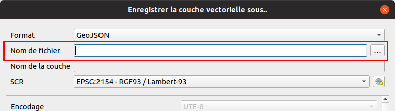
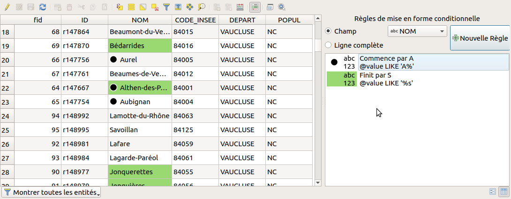

---
Title: Expression
Favicon: logo.png
...

[Back](index.md)

[TOC]

# Les expressions

## Les infobulles

TODO

## Requêtage sur une couche vecteur

* La couche commune comportent de nombreuses entités. On peut le voir graphiquement sur le canevas de la carte, 
mais aussi en ouvrant sa table attributaire.

* Pensez-bien à sélectionner votre couche dans la légende. Cela active ou non les actions dans la barre d'outils ci-dessus.
* À l'aide de l'outil `Identifier les entités` dans la barre d'outils, faire un clic sur une entité.
    * Un nouveau panneau s'ouvre présentant les résultats.
* Depuis cette barre d'outils, ouvrir la `table attributaire`.
    * Comme dans un tableur, les données textes sont à gauche, les données numériques sont à droite.
    * Faire le tour de cette nouvelles boîte de dialogue.
* *Pour info*, le jaune dans les icônes représentent très souvent la notion de sélection dans QGIS.
* Utilisons l'outil de sélection à l'aide de la souris et affichons les entités sélectionnées dans la table.
* Utilisons l'icône avec un carré jaune et un epsilon (le `ε`) afin de construire une expression de sélection.
    * Cette icône se trouve dans la barre d'outils ci-dessus de la fenêtre principale
    * ou dans la nouvelle fenêtre de la table attributaire.

* On souhaite pouvoir sélectionner le(s) entité(s) qui répondent au critère `"CODE_INSEE" = '70550'`, pour cela utiliser 
l'interface graphique afin de construire la requête. Que remarquons-nous sur la structure de l'expression ?
    * Les nom des champs sont entre `""`
    * Les chaînes de caractères dans les cellules sont entre `''`.
* On souhaite désormais toutes les communes dont :
    * le code INSEE commence par `70` à l'aide de l'opérateur `like` :
        * Le pourcentage permet de faire un caractère "joker" remplacant n'importe quelle chaîne de caractères
            * Solution : `"CODE_INSEE" like '70%'`
        * la population est inférieur à 1000 habitants : 
        * Les populations sont au format texte et non nombre entier : `to_int`
            * Solution : `to_int( "POPUL" ) < 1000`
    * les communes du `70` et du `25`
    * les trois communes 

## Enregistrer le résultat d'une sélection en tant que nouvelle couche

* On peut enregistrer la sélection de la commune dans une nouvelle couche de données en faisant un clic-droit sur la couche puis `Exporter`.
* Choisir un format pour l'export, par exemple `ESRI Shapefile`. On peut aussi choisir de faire une reprojection des données.

**Attention**, dans la fenêtre pour exporter les entités, **toujours** utiliser les trois petits points lors de la saisie du nom de fichier !

## Outil d'analyse vecteur

* QGIS propose de nombreux algorithmes d'analyse spatiale. 
    * Nous allons utiliser l'algorithme `Extraire par localisation`/`Sélection par localisation` afin de récupérer seulement les troncons de route qui `intersectent` la commune.
    * Nous souhaitons obtenir une couche des départements Français à l'aide de la couche des communes. Il s'agit d'un regroupement.
        * Que remarque-t-on sur la table attributaire ?

### La modification par algorithme de traitement

QGIS permet maintenant de **modifier directement des géométries** sélectionnées à partir d'un **algorithme de traitement.**. Pour cela:

* Ouvrir la boîte à outils via le menu **Traitement / Boîte à outils**
* **Sélectionner** un ou plusieurs objets
* Chercher un algorithme dans le panneau **Boîte à outils de traitement** , par exemple **Accrochage de points à la grille**
* Activer le bouton jaune **Editer les entités sur place**
* Lancer l'algorithme avec valeur `500` en X et Y et lancer pour tester le traitement.
* On peut toujours revenir en arrière via **CTRL+Z**

     
## La table attributaire : mise en forme conditionnelle

Pour retrouver plus facilement des objets dans une grande table attributaire, on peut utiliser la fonctionnalité de QGIS de **mise en forme conditionnelle** des champs ou des lignes de la table.

Le principe est de fournir une ou plusieurs **règles**, via une **expression QGIS**, et d'y associer un **style** de champ ou de ligne. Par exemple `@value LIKE 'A%'`

## Calculatrice de champ

La calculatrice de champ est un outil accessible avec le `boulier` dans la fenêtre de la table attributaire. 
Il permet la mise à jour d'un champ existant ou alors de créer un nouveau champ.

**Pour toutes modifications d'une couche vecteur**, on doit se placer dans une session d'édition, à l'aide du petit stylo dans la barre d'outils `Numérisation` ou dans la fenêtre de la table attributaire.

## Panneau statistique

Dans la barre d'outils `Attributs`, il existe un outil de statistiques sur un champ. 

Il fonctionne à l'aide d'une couche vecteur en entrée ainsi que d'un champ de cette couche ou une expression.

