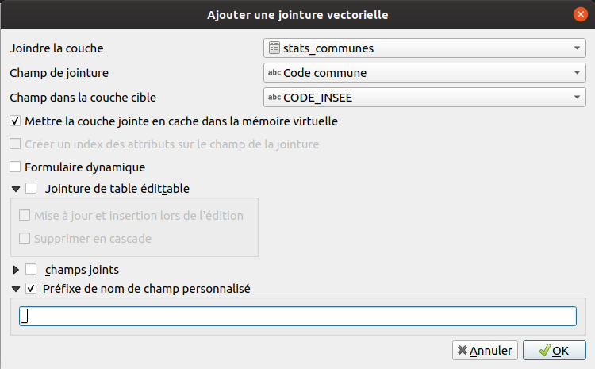

---
Title: Jointure
Favicon: logo.png
Sibling: yes
...

[TOC]

# Faire une jointure attributaire

Il est courant d'avoir une couche spatiale et d'avoir un autre fichier type tableur avec
des informations complémentaires à propos de cette couche spatiale. Nous souhaiterions donc ajouter ces informations 
du tableur à notre couche spatiale.

Lien vers la documentation : 
https://docs.qgis.org/3.10/fr/docs/user_manual/working_with_vector/vector_properties.html#joins-properties

Les étapes : 

* Préparer un fichier tableur "simple" avec les entêtes des colonnes et les données.
    * Pas d'autres entêtes ou autre texte.
    * Il peut y avoir plusieurs feuilles, QGIS permet de choisir la feuille.
* Charger la table dans QGIS : 
    * Si fichier CSV :
        * à l'aide de l'outil `Texte délimité` dans le `gestionnaire des sources de données`
    * Si fichier ODS, XLS :
        * à l'aide du panneau explorateur
        * ou à l'aide de l'outil `Vecteur` (même si il s'agit d'une table, sans géométrie) dans le 
        `gestionnaire des sources de données`
* Vérifier qu'il existe bien un champ commun aux deux couches avant de faire la jointure et qu'il peut y avoir une correspondance.
* Si ce n'est pas le cas, faire les modifications nécessaires à l'aide de la calculatrice de champ.
* Se rendre dans les propriétés de la couche vecteur "parente" dans l'onglet `jointure`.
* Ajouter une nouvelle jointure :

* Afin de conserver définitivement ces données supplémentaires dans la table attributaire, on peut exporter la table 
(clic droit sur la couche, puis exporter). Lire la page sur les [projections](./projections.md) pour voir comment exporter.

*Note*, afin de conserver ces champs qui peuvent être très long, on peut utiliser un geopackage.
