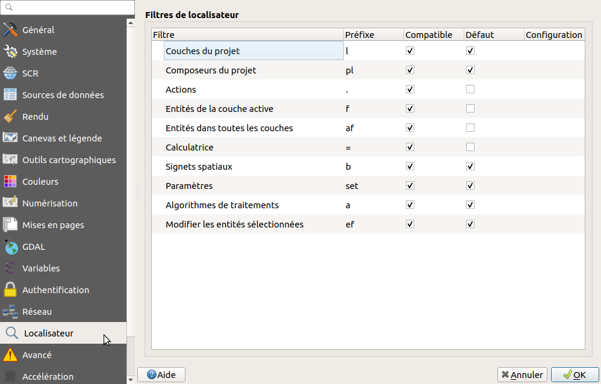
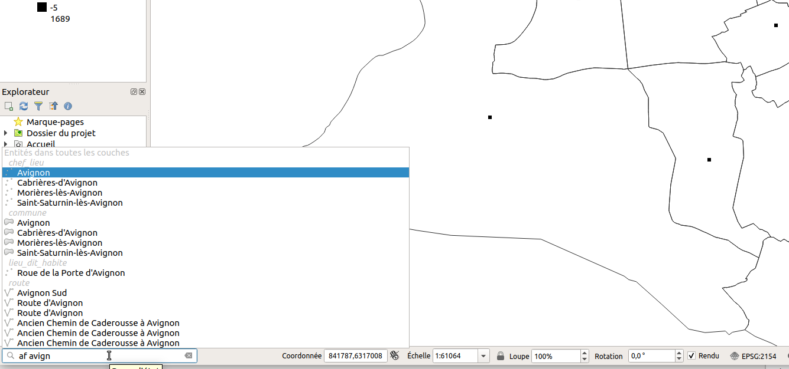

---
Title: Autres
Favicon: logo.png
Sibling: yes
...

[TOC]

# Autres

## La barre de recherche:

QGIS 3 propose un nouvel **outil de recherche** par **autocomplétion** intégré dans la barre de statut, **en bas à gauche**. QGIS permet de rechercher parmi:

* Actions
* Calculatrice
* Algorithmes de traitement
* Entités dans toutes les couches
* Signets spatiaux
* Modifier les entités sélectionnées
* Entités de la couche sélectionnée
* Couches du projet
* Composeurs du projet
* Paramètres

Dans les propriétés de QGIS : 

La recherche dans les entités de couche ne montre des résultats que sur le **champ d'affichage**. Dans les propriétés de 
la couche, onglet **Affichage**

On lance la recherche via **CTRL+K** ou en cliquant dans le champ, puis on peut taper un **code pour filtrer la recherche** (ex: af), et enfin le **terme recherché**. On valide avec **Entrée** pour afficher l'item trouvé.

