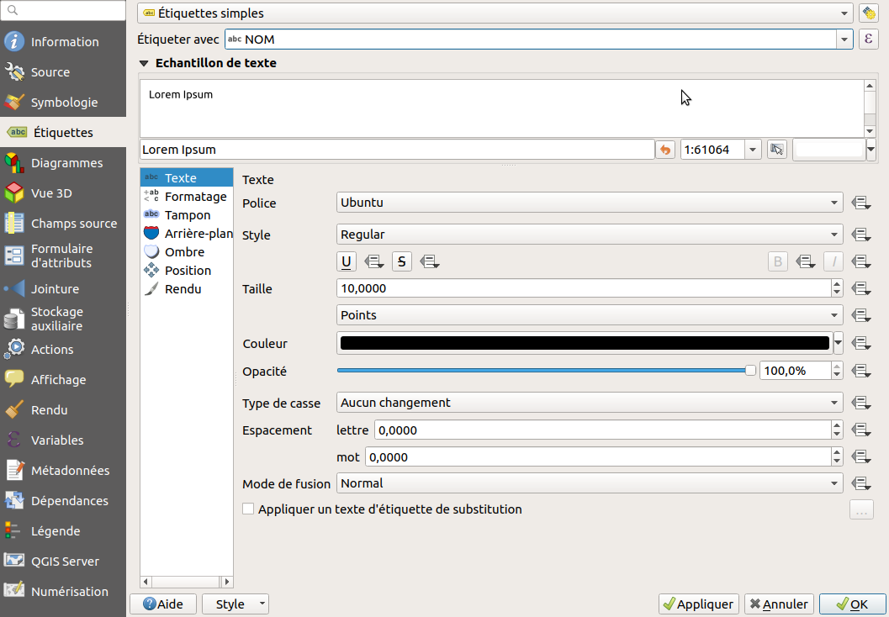
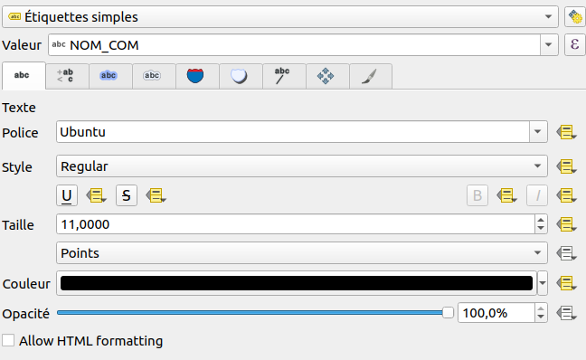
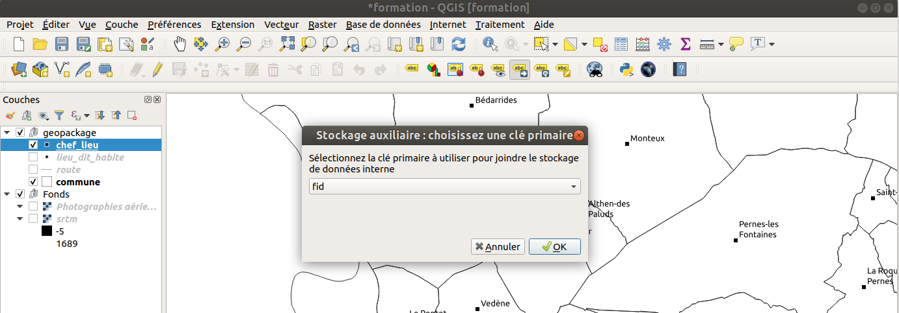

# Les étiquettes

## Rappel des fonctionnalités

Documentation : https://docs.qgis.org/latest/fr/docs/user_manual/working_with_vector/vector_properties.html#labels-properties

QGIS 3 présente une interface unifiée qui liste toutes les options accessibles **dans une seule fenêtre** dans l'onglet 
`Étiquettes` des propriétés de la couche vecteur :

* un **aperçu** du rendu de l’étiquette
* une liste de **sous-onglets** pour configurer finement les options

* Nous allons faire un étiquetage simple sur la couche `communes` :
    * Se rendre dans l'onglet `Étiquettes` dans les propriétés de la couche vecteur : 

* Choisir : 
    * `Étiquettes simples`
    * `Étiquetter avec` le nom du champ que l'on souhaite afficher.

* Choisir une taille de police adaptée
* Ajouter une petite zone tampon (un liséré blanc)
* Définir des seuils de visibilités dans l'onglet `Rendu`.

Le moteur d’étiquetage de QGIS est riche en fonctionnalités. L’interface regroupe les différentes options par
thèmes:

* **Texte** : Police, Taille, casse, etc.
* **Formatage** : Retour à la ligne, alignement, formatage des nombres décimaux
* **Tampon** : taille, couleur, transparence
* **Arrière-plan** : Ajout de n’importe quel fond derrère l’étiquette (forme, SVG, etc.) + paramétrage fin
* **Ombre** : Définition d’un ombrage (position, décalage, transparence, etc.)
* **Connecteurs** : permet de générer une flèche entre le point géographique et l'étiquette quand ils sont éloignés
* **Position** : en fonction du type (polygone, lignes, points), Position et rotation via des colonnes, priorité
* **Rendu** : seuils d’échelle, paramètres avancés

**Certaines options sont spécifiques pour une géométrie.**

Chaque paramètre de la configuration peut soit:

* être choisi de manière classique parmi les **choix proposés**
* être dynamique via le **choix d’un attribut ou d’une expression**

Quand un icône est jaune, cela veut dire que le **contôle par les données** est actif. Le paramètre dans l'interface
graphique peut ne pas être pris en compte car il est **peut-être** surchargé au niveau de l'entité. Il est possible de
désactiver en faisant un clic-droit sur une propriété en jaune.

## Le déplacement manuel des étiquettes

QGIS 3 permet maintenant de **déplacer les étiquettes manuellement** sans avoir besoin de créer de couches spécifiques, ou d'utiliser le plugin **Easy Custom Labelling**

**Notes** 

* Un déplacement manuel d'étiquette n'est **valable que pour une échelle fixe** !
* Compacter d'abord les étiquettes: `wordwrap("NOM", 13, '-')`
* Il faut **absolument** une **clé primaire de type entier** comme **identifiant unique**

**Étapes**

* Pour gérer le déplacement, il faut utiliser la **barre d'outils Étiquettes**
* Choisir l'**échelle**
* Cocher **Mettre en surbrillance les Étiquettes et les Diagrammes épinglés**
* Cocher l'outil **Déplacer les Etiquettes et les Diagrammes**
* Au 1er clic sur la carte, une fenêtre demande de choisir l'**identifiant unique de la couche**

Vous pouvez ensuite utiliser cet outil **Déplacer les étiquettes et les diagrammes** en cliquant sur l'étiquette et en la faisant **glisser à l'endroit désiré**. Les étiquettes déplacées apparaissent **avec un fond bleu**

D'autres outils permettent de **tracer un rectangle autour des entités choisies** et

* **épingler/désépingler** les étiquettes: on les réinitialise,
* **masquer/afficher** les étiquettes: icône **oeil**

On peut aussi manuellement **pivoter** chaque étiquette, ou **modifier toutes les propriétés** d'une étiquette.

Les données sont enregistrées **dans l'archive du projet QGZ**, pour chaque couche. On peut voir les paramètres dans les propriétés de la couche, onglet **Stockage auxiliaire**.

## Utilisation d'une expression pour construire l'étiquette

Par défaut, nous avons utilisé un champ de notre attributaire pour construire notre étiquette.

Nous souhaiterions désormais vouloir étiquetter en utilisant deux champs : le nom de la commune ET son code INSEE.
Il faut désormais utiliser le petit epsilon violet, qui comme vu dans la [présentation de l'interface](./interface.md)
fait référence à la notion des **expressions**.

* Pour afficher le nom de la commune avec le code INSEE
    * Attention aux différents opérateurs `+`, `||` et `concat()` qui permettent tous de concaténer des chaînes, mais
    attention aux valeurs NULL et aux valeurs mathématiques. On recommande `concat` bien qu'elle soit un peu plus complexe.
    * Solution `concat("NOM", '\n', "CODE_INSEE")`

* afficher une information calculée à la volée, comme la superficie de la commune en km² : 
    * La superficie en anglais se dit `area`.
    * La projection de la couche est actuellement en m, donc la surface est en m².
    * Solution partielle `$area / 1000000`
    * Solution finale `concat("NOM", '\n', round($area / 1000000, 2), ' km²')`

* changer pour afficher la densité de population
    * Solution `concat("NOM", '\n', round("POPULATION" / ($area / 1000000, 2)), ' hab/km²')`
