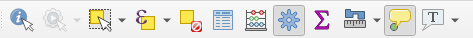

# Les expressions

Les expressions sont omniprésentes dans QGIS. Il est important de les maîtriser un minimum si vous voulez pleinement
exploiter QGIS.

## Nommage d'une entité

Dans les propriétés de la couche vecteur, onglet `Infobulle`, il est bon de paramétrer comme QGIS doit composer
le nom d'une entité.

Par exemple, sur une couche commune, on peut mettre le nom du champ : 

* à l'aide du menu déroulant, on peut choisir le nom d'un champ, `NOM_COM`.
* en cliquant sur l'epsilon violet, on arrive dans la fenêtre des expressions de QGIS : 
    1. Effacer le contenu à gauche
    1. Dans le panneau du milieu, aller dans `Champs et Valeurs` et double-cliquer sur le nom du champ `NOM_COM`.
    1. Remarquer l'ajout dans le panneau à gauche de l'expression suivante `"NOM_COM"`.
    1. Cliquer sur OK
    1. Cette expression est équivalente à la première, mais elle est plus correcte syntaxiquement.
    
**Il faut retenir** que le nom des champs sont entre guillemet double `""`.

* retournons dans la fenêtre des expressions. Nous souhaitons dorénavant afficher le nom de la commune, la chaîne de
caractère ` : ` et le code INSEE de la commune.
    * Effacer le contenu à gauche
    * Dans le panneau du milieu, aller dans `Champs et Valeurs` et double-cliquer sur le nom du champ `NOM_COM`.
    * Contrairement aux noms des champs qui sont entre guillemet double `""`, les chaînes de caractères sont entre guillemet simple `''`
    * Pour concaténer, on peut utiliser `||`, `+` ou la fonction `concat()`
    * Une solution possible `concat("NOM_COM", ' : ', "INSEE_COM")`

## Les infobulles

Similaire à la section précédente, on peut définir l'infobulle. On utilise cette fois-ci du HTML pour la mise en forme.

* Pour activer les infobulles sur la carte, menu `Vue` ▶ `Afficher les infobulles`.
* Puis retourner dans les propriétés de la couche vecteur, onglet `Infobulle`.

**Rappel succinct** sur du HTML pour faire une liste à puce :

```html
<h3>Titre</h3>
<p>Paragraphe</p>
<ul>
    <li>Une</li>
    <li>liste</li>
    <li>à</li>
    <li>puce</li>
</ul>
```

* Les balises `<h1></h1>`, `<h2></h2>`, `<hX></hX>` représentent des titres, en commençant par le plus important. En anglais **header**.
* `<p></p>` est un paragraphe
* `<ul></ul>` est une liste à puce non ordonnée. En anglais **unordered list**.
* `<ol></ol>` est une liste ordonnée. En anglais **ordered list**.
* `<li></li>` est un élément dans une liste. En anglais **list item**.

Il est possible de personnaliser l'affichage de l'infobulle à l'aide de CSS.

Exemple d'une infobulle QGIS : 

```html
<ul>
    <li>[% "NOM_COM" %]</li>
    <li>[% "INSEE_COM" %]</li>
    <li>[% "NOM_DEP" %]</li>
</ul>
```

`[% ... %]` permet à QGIS de reconnaître qu'il s'agit d'une expression qu'il faut évaluer au sein d'un autre bloc de texte.


## Requêtage sur une couche vecteur

* La couche commune comporte de nombreuses entités. On peut le voir graphiquement sur le canevas de la carte, 
mais aussi en ouvrant sa table attributaire.



* Pensez-bien à sélectionner votre couche dans la légende. Cela active ou non les actions dans la barre d'outils ci-dessus.
* À l'aide de l'outil `Identifier les entités` dans la barre d'outils, faire un clic sur une entité.
    * Un nouveau panneau s'ouvre présentant les résultats.
* Depuis cette barre d'outils, ouvrir la `table attributaire`.
    * Comme dans un tableur, les données textes sont à gauche, les données numériques sont à droite.
    * Faire le tour de cette nouvelle boîte de dialogue.
* *Pour info*, le jaune dans les icônes représente très souvent la notion de sélection dans QGIS.
* Utilisons l'outil de sélection à l'aide de la souris et affichons les entités sélectionnées dans la table.
* Utilisons l'icône avec un carré jaune et un epsilon (le `ε`) afin de construire une expression de sélection.
    * Cette icône se trouve dans la barre d'outils ci-dessus de la fenêtre principale
    * ou dans la nouvelle fenêtre de la table attributaire.

* On souhaite pouvoir sélectionner le(s) entité(s) qui répondent au critère `"CODE_INSEE" = '70550'`, pour cela utiliser 
l'interface graphique afin de construire la requête. Que remarquons-nous sur la structure de l'expression ?
    * Les nomS des champs sont entre `""`
    * Les chaînes de caractères dans les cellules sont entre `''`.
* On souhaite désormais toutes les communes dont :
    * le code INSEE commence par `70` à l'aide de l'opérateur `like` :
        * Le pourcentage permet de faire un caractère "joker" remplaçant n'importe quelle chaîne de caractères
            * Solution : `"CODE_INSEE" like '70%'`
        * la population est inférieure à 1000 habitants : 
        * Les populations sont au format texte et non nombre entier : `to_int`
            * Solution : `to_int( "POPUL" ) < 1000`
    * les communes du `70` et du `25`
    * les trois communes 

## Enregistrer le résultat d'une sélection en tant que nouvelle couche

* On peut enregistrer la sélection de la commune dans une nouvelle couche de données en faisant un clic-droit sur la couche puis `Exporter`.
* Choisir un format pour l'export, par exemple `ESRI Shapefile`. On peut aussi choisir de faire une reprojection des données.

!!! danger
    **Attention**, dans la fenêtre pour exporter les entités, **toujours** utiliser les trois petits points lors de la saisie du nom de fichier !


     
## La table attributaire : mise en forme conditionnelle

Pour retrouver plus facilement des objets dans une grande table attributaire, on peut utiliser la fonctionnalité de QGIS de **mise en forme conditionnelle** des champs ou des lignes de la table.

Le principe est de fournir une ou plusieurs **règles**, via une **expression QGIS**, et d'y associer un **style** de champ ou de ligne. Par exemple `@value LIKE 'A%'`


## Calculatrice de champ

La calculatrice de champ est un outil accessible avec le `boulier` dans la fenêtre de la table attributaire. 
Il permet la mise à jour d'un champ existant ou alors de créer un nouveau champ.

**Pour toutes modifications d'une couche vecteur**, on doit se placer dans une session d'édition, à l'aide du petit stylo dans la barre d'outils `Numérisation` ou dans la fenêtre de la table attributaire.

## Panneau statistique

Dans la barre d'outils `Attributs`, il existe un outil de statistiques sur un champ. 

Il fonctionne à l'aide d'une couche vecteur en entrée ainsi que d'un champ de cette couche ou une expression.


