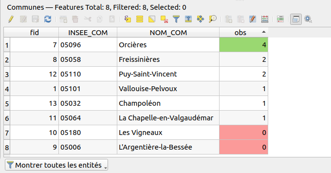

# Les formulaires

## Documentation

* Les formulaires
    * https://docs.qgis.org/latest/fr/docs/user_manual/working_with_vector/vector_properties.html#attributes-form-properties
* Les relations 1-n dans QGIS
    * https://docs.qgis.org/latest/fr/docs/user_manual/working_with_vector/attribute_table.html#creating-one-or-many-to-many-relations

## Objectif

QGIS permet de faire de masques de saisie lors de la création ou l'édition des données : avoir des menus déroulants, des
cases à cocher, des zones de textes en lecture seule...

Pour cela, nous allons réaliser une petite base de données pour de la saisie d'observations faunistiques. Nous pouvons
utiliser PostgreSQL ou alors une base de données fichier comme Geopackage.

Nous allons obtenir des relations **1-n**, par exemple, à une commune, nous avons plusieurs observations. De même, un
observateur possède 0 ou plusieurs observations, mais une observation appartient à un seul observateur. QGIS permet de
définir des relations entre les tables.

## Exercice

### Création des tables

Nous allons utiliser le modèle de données suivant :

* Table `especes`, non spatiale
    * ID
    * Nom commun : `nom_commun`
    * Nom scientifique : `nom_scientifique`
    * Autres champs métiers possibles : Taxref, page Wikipédia, photo etc
* Table `observateurs`, non spatiale
    * ID
    * Nom : `nom`
    * Prénom  : `prenom`
* Une table des communes ou département avec un code INSEE, polygonale
* Table `observations`, géométrie ponctuelle
    * ID
    * Date : `date`
    * Espèce : `espece_id`, pour stocker l'identifiant de l'espèce
    * Observateur : `observateur_id`, pour stocker l'identifiant de l'observateur
    * Genre (liste fermé) : `genre`
    * Nombre : `nombre`
    * En groupe : `en_groupe`, type booléen
    * Photo : `photo`
    * Remarque : `remarque`

Pour la création des tables :

* Dans le cas de l'utilisation d'un Geopackage :
    * 
    * Il y a déjà le champ `fid` qui fait office de clé primaire.
    * Astuce pour la création des champs :
        * créer juste le premier champ dans la boite de dialogue de création de couche. Nous utiliserons les outils dans le 
panneau `Table attributaire` pour ajouter les autres attributs. Il y a plus de choix.

* Dans le cas de l'utilisation de PostGIS : 
    * Utiliser l'assistant de création de table du DB Manager
    * Ou alors du SQL !

### Création des relations

Menu `Projet` ▶ `Propriétés` ▶ `Relations`, nous pouvons créer ici les relations **1-n** entre les tables.

Par convention personnelle, je nomme les relations suivant le modèle `parent_enfant`, par exemple `commune_observation`.


### Création des formulaires

Dans les propriétés de la couche vecteur en question, onglet `Formulaire d'attributs`:

* Couche `observateurs` : 
    * Mode formulaire : `Génération automatique`
    * Mettre un alias sur les champs, langage humain
    * Mettre le bon outil d'édition pour les champs : `cachée` ou `texte`
    * Mettre les contraintes et les renforcer
* Couche `especes` : 
    * Même mode de formulaire
    * Alias
    * Configurer aussi l'outil d'édition, avec l'unicité sur le nom de l'espèce
    * Bonus : utiliser une expression pour vérifier que la première lettre est bien une majuscule.
    `regexp_match( left("nom_commun", 1), '[A-Z]')`
* Couche `observations` : 
    * Bonus : une expression pour la date pour éviter une saisie dans le futur
    
### Les champs virtuels

Sur la couche des communes, on peut ajouter un champ virtuel afin de compter le nombre d'observations par commune : 

```
relation_aggregate(
	relation:='observation_commune',
	aggregate:='count',
	expression:="fid"
)
```

Bonus, on peut ajouter une mise en forme conditionnelle




Rouge si
```
@value =  minimum(  "obs" )
```

Vert si
```
@value =  maximum(  "obs" )
```
    
### Solution complète


[Télécharger le GPKG](./formulaire.gpkg) puis dans QGIS ▶ Menu `Projet` ▶ `Ouvrir depuis...` ▶ `Geopackage`
