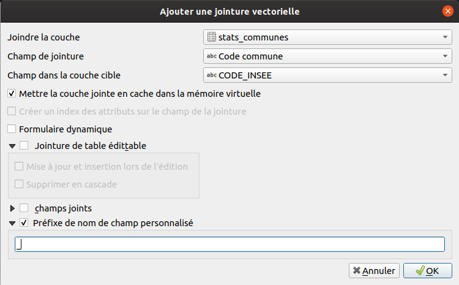

# Faire une jointure attributaire

Il est courant d'avoir une couche spatiale et d'avoir un autre fichier type tableur avec
des informations complémentaires à propos de cette couche spatiale. Nous souhaiterions donc ajouter ces informations 
du tableur à notre couche spatiale.

**Important**, une jointure attributaire fait en ce que l'on appelle une jointure de relation **1-1**. Une ligne dans le
fichier tableur correspond une ligne dans la couche des communes. On souhaite pouvoir "étendre" la table attributaire
de la couche des communes. Pour une relation de type **1-n** (plusieurs lignes du fichier tableur pour une ligne de la couche
commune), il faut regarder du côté des relations QGIS dans le chapitre sur les [formulaires](./formulaire.md).

Lien vers la documentation : 
https://docs.qgis.org/latest/fr/docs/user_manual/working_with_vector/vector_properties.html#joins-properties

Les étapes : 

* Préparer un fichier tableur "simple" avec les entêtes des colonnes et les données.
    * Pas d'autres entêtes ou autre texte.
    * Il peut y avoir plusieurs feuilles, QGIS permet de choisir la feuille.
* Charger la table dans QGIS : 
    * Si fichier CSV :
        * à l'aide de l'outil `Texte délimité` dans le `gestionnaire des sources de données`
    * Si fichier ODS, XLS :
        * à l'aide du panneau explorateur
        * ou à l'aide de l'outil `Vecteur` (même s'il s'agit d'une table, sans géométrie) dans le 
        `gestionnaire des sources de données`
* Vérifier qu'il existe bien un champ commun aux deux couches avant de faire la jointure et qu'il peut y avoir une correspondance.
* Si ce n'est pas le cas, faire les modifications nécessaires à l'aide de la calculatrice de champ.
* Se rendre dans les propriétés de la couche vecteur "parente" dans l'onglet `jointure`.
* Ajouter une nouvelle jointure :

* Afin de conserver définitivement ces données supplémentaires dans la table attributaire, on peut exporter la table 
(clic droit sur la couche, puis exporter). Lire la page sur les [projections](./projections.md) pour voir comment exporter.

*Note*, afin de conserver ces champs qui peuvent être très long, on peut utiliser un geopackage.
