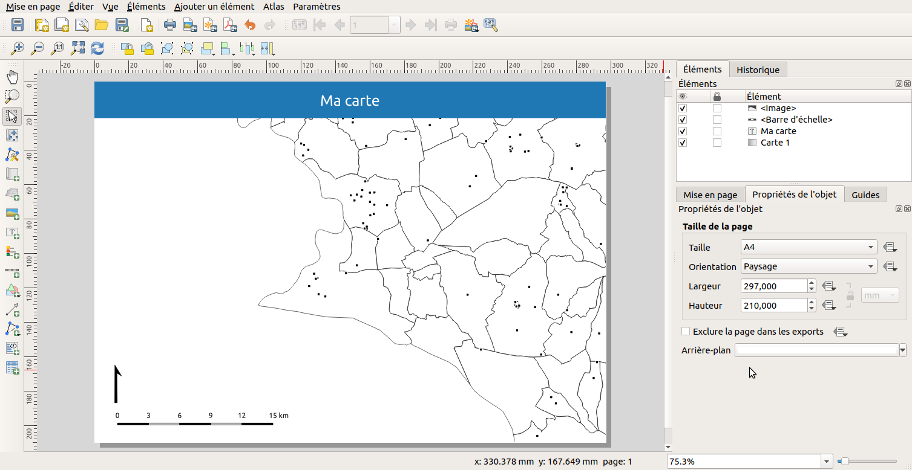

# Mise en page

Anciennement **composeur d'impression** dans QGIS 2

## Documentation

* https://docs.qgis.org/3.10/fr/docs/user_manual/print_composer/index.html

## Rappel sur les éléments d'une carte

* Menu `Projet` ▶ `Mise en page`
* Pour chaque projet QGIS, on peut créer une ou plusieurs **mise en page**.
* Un **gestionnaire de mise en page** permet d’ajouter, modifier, renommer, supprimer une mise en page.
* Chaque mise en page permet de créer sa carte à imprimer, en y insérant autant d’éléments que nécessaire.
* Une mise en page doit au moins contenir:
	* **carte**
	* **légende**
	* **barre d’échelle**
	* **flèche Nord**
	* bloc **texte** : titre, sources, commentaire, etc.
* D'autres éléments sont possibles:
    * bloc **HTML** : une page web (ou distante)
	* **image** : logos (png, SVG)
	* **table attributaire**
	* grille **régulière** sur une carte (graticule)
    * carte de localisation (à une échelle plus petite), ou alors un cartouche, pour le centre-ville
    * ...

## Utilisation de l'outil


Depuis QGIS 3, on peut modifier les propriétés de chaque page indépendemment: taille et rotation par exemple: faire
 **clic-droit** sur la page et **Propriétés de la page**.

En utilisant les boutons "plus" dans la barre d'outils à gauche, ajouter les éléments à votre page. 
Dans le panneau `Propriétés de l'objet`, configurer les éléments en ouvrant les menus "tiroirs".

Chaque élément possède des propriétés qui lui sont propres.

Début de mise en page :



* **Question**, que manque-t-il sur cette mise en page?

* QGIS permet de créer des composeurs avec **plusieurs pages**. Par exemple, une 1ère page pour la carte et la légende, 
et une seconde page pour la table attributaire et des images.

### Encore plus loin avec les expressions

Utiliser des expressions avec du texte dans les impressions : 
https://docs.qgis.org/3.10/en/docs/user_manual/print_composer/composer_items/composer_label.html#exploring-expressions-in-a-label-item

## Générer un atlas

Pour le moment, nous n'avons fait qu'une carte statique. Imaginons désormais que nous souhaiterions faire une collection 
de PDF, une par commune de notre département.

Pour générer un **atlas**, il faut: 

* l'activer, via le menu **Atlas / Paramètres de l'atlas** en cochant la case **Générer un atlas**
* de choisir la **couche de couverture**, par exemple les communes
* de choisir le champ ou l'expression qui donne le **nom de l'objet**, par exemple `concat("NOM", ' - ', "CODE_INSEE")`
* de choisir un **filtre** (optionnel): `"NOM LIKE 'A%'"`
* d'ordonner par un champ: `"NOM"`
* d'aller dans les **propriétés de la carte**, et de cocher **Contrôlé par l'atlas** et choisir la marge ou l'échelle 
pour zoomer sur chaque objet: 
**Échelle prédéfinie**
* d'activer l'aperçu pour tester: menu **Atlas / Aperçu de l'atlas** puis utiliser la **barre d'outil Atlas** pour 
passer d'une commune à l'autre


Documentation : https://docs.qgis.org/3.10/fr/docs/user_manual/print_composer/create_output.html#generate-an-atlas

**NB:** 

* On peut utiliser des **expressions QGIS** dans les **Étiquettes**, dans les filtres, dans les propriétés configurables 
via des expressions.
  * Par exemple, on souhaite factoriser le nom de l'organisation:
    * Faire une variable au [niveau global de QGIS](./interface.md) dans l'onglet `Variables`
    * Modifier une étiquette pour utiliser cette `variable` dans la fenêtre des expressions pour l'utiliser.
* On peut contrôler le style de l'objet courant (la commune) via une expression dans la symbologie d'une couche à l'aide des icônes à droite : 


Pour la couleur de bordure :

```sql
CASE 
WHEN @atlas_featureid = $id THEN 'red'
ELSE 'black'
END
```

Pour la largeur de bordure :

```sql
CASE 
WHEN @atlas_featureid = $id THEN 1
ELSE 0.2
END
```

*Note*, ces icônes deviennent jaune lorsqu'il y a une expression.

### Générer un rapport

Documentation : https://docs.qgis.org/3.10/fr/docs/user_manual/print_composer/create_reports.html

QGIS 3 ajoute un nouvel outil pour gérer finement un document à imprimer, via un objet qui s'appelle **Rapport**, qui permet :

* de définir une **page d'entête et un pied de page**
* d'insérer des pages dynamiquement dans des **groupes et des sous-groupes de pages**

L'idée est de pouvoir tout contrôler via QGIS, et d'éviter d'exporter une mise en page en PDF et de le reprendre avec un outil d'édition tiers. 
Pour cela, on utilise le menu **Projet / Nouveau rapport**.

L'interface du rapport est la même qu'une mise en page (cf ci-dessus), sauf qu'il y a un panneau supplémentaire, l'`Éditeur de rapport` sur la gauche
et que la barre d'outils `Atlas` n'existe plus.

L'arbre dans ce nouveau panneau permet de contrôler les paramètres du rapport :

* **Rapport** permet de créer/modifier l'**entête** et le **pied de page** de tout le document.
* Le **bouton + vert** permet d'ajouter des **pages statiques** ou une **section de groupes de champs**
* Chaque section de groupes de champs permet d'**itérer sur les objets d'une couche**, comme pour un atlas. Elle est caractérisée par **une couche et un nom de champ**, et peut avoir
	* une **entête**
	* un **corps de document**
	* un **pied de page**
* On peut ajouter un **sous-groupe de champs**, si la couche fille contient un champ qui est aussi **présent dans la couche parente** et permet de faire le lien, `CODE_INSEE`par exemple. Cela devient donc un atlas dans un atlas.
Concrétement en guise d'exemple, à l'échelle d'une région, nous pouvons itérer sur les départements, puis dans chaque département sur les communes.

**Inconvénient**: on ne peut pas filtrer sur les couches des sections de groupes de champs.

**Astuce** : on peut importer un modèle de mise en page dans un rapport.


