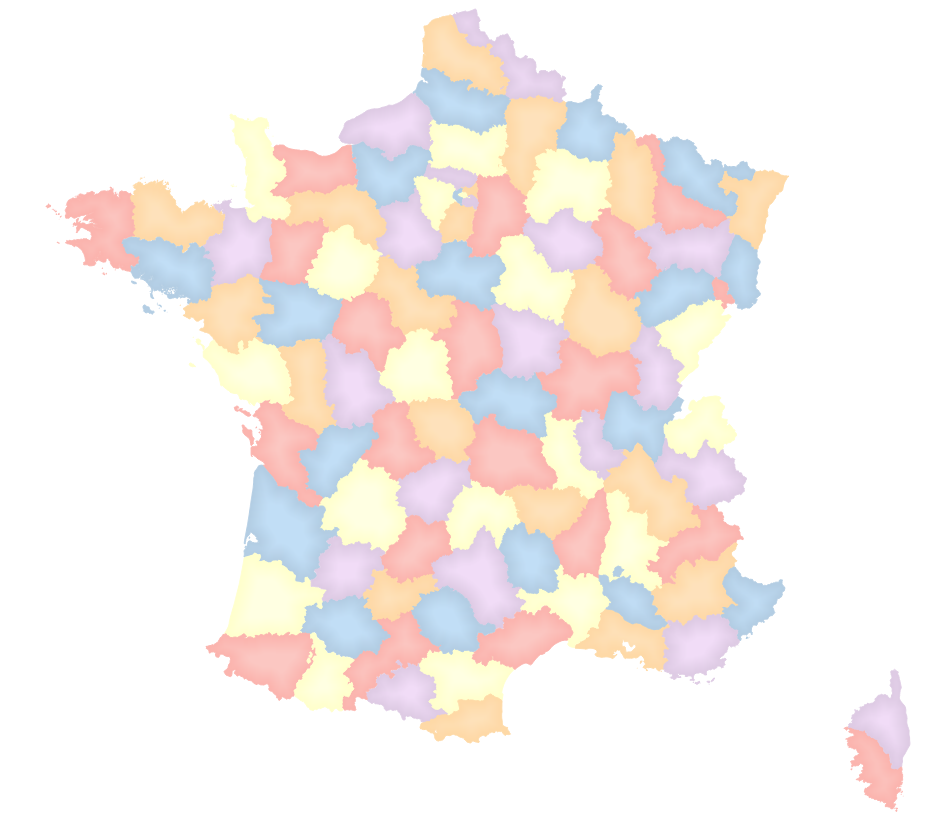

---
Title: Exercices
Favicon: logo.png
Sibling: yes
...

[TOC]

# Théorème des quatre couleurs

https://fr.wikipedia.org/wiki/Th%C3%A9or%C3%A8me_des_quatre_couleurs

Extrait de Wikipédia:

Le théorème des quatre couleurs indique qu'il est possible, en n'utilisant que quatre couleurs différentes, de colorier 
n'importe quelle carte découpée en régions connexes, de sorte que deux régions adjacentes (ou limitrophes), c'est-à-dire 
ayant toute une frontière (et non simplement un point) en commun reçoivent toujours deux couleurs distinctes.

## Objectif

**Ajouter** à une couche **existante** les informations pour réaliser ce genre cartographique:

Au final, nous ne souhaitons une nouvelle couche.
 
## Étapes

1. En utilisant, le menu 