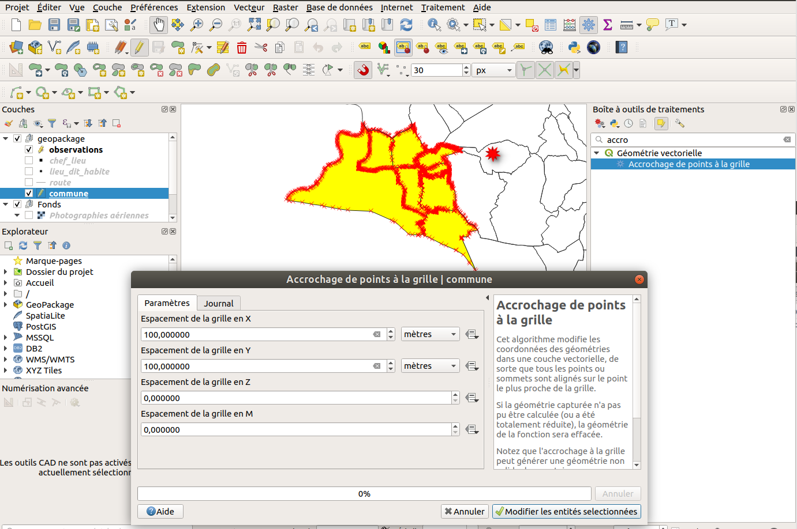

---
Title: Processing
Favicon: logo.png
Sibling: yes
...

[TOC]

# Processing

## Outil d'analyse vecteur

* QGIS propose de nombreux algorithmes d'analyse spatiale. 
    * Nous allons utiliser l'algorithme `Extraire par localisation`/`Sélection par localisation` afin de récupérer seulement les troncons de route qui `intersectent` la commune.
    * Nous souhaitons obtenir une couche des départements Français à l'aide de la couche des communes. Il s'agit d'un regroupement.
        * Que remarque-t-on sur la table attributaire ?

## La modification par algorithme de traitement

QGIS permet maintenant de **modifier directement des géométries** sélectionnées à partir d'un **algorithme de traitement**. Pour cela:

* Ouvrir la boîte à outils via le menu **Traitement / Boîte à outils**
* **Sélectionner** un ou plusieurs objets
* Chercher un algorithme dans le panneau **Boîte à outils de traitement** , par exemple **Accrochage de points à la grille**
* Activer le bouton jaune **Editer les entités sur place**
* Lancer l'algorithme avec valeur `500` en X et Y et lancer pour tester le traitement.
* On peut toujours revenir en arrière via **CTRL+Z**

