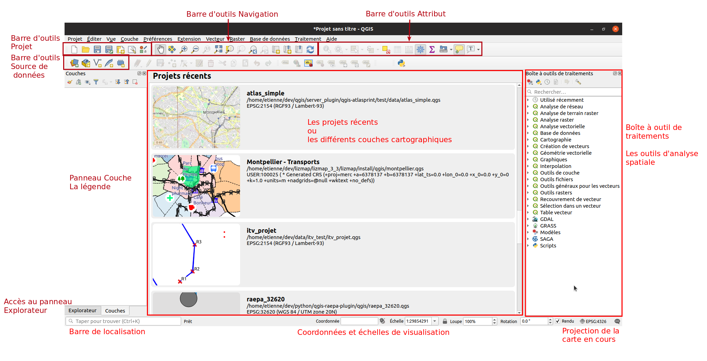

---
Title: Projections
Favicon: logo.png
Sibling: yes
...

[TOC]

# Gestion de la projection dans QGIS

## Les couches et le projet

* Les couches (spatiales) ont chacune une projection.
    * Dans les propriétés de la couche, onglet `Information`.
    * Ou alors en passant la souris sur la couche pour faire afficher l'infobulle dans la légende.
* Le projet a lui aussi une projection.
* Il peut donc y avoir autant de projections que de couches plus celle du projet.

La projection du projet se trouve en bas à droite : 

## Les projections courantes

Ceci est vrai en France métropolitaine :

* **EPSG:4326**, unité en degrée, mondiale
* **EPSG:3857**, dit Google Mercator, en mètre, mondiale
* **EPSG:2154** identique à **IGNF:LAMB93**, en mètre

## Reprojection d'une couche

Note : SCR : Système de Coordonnées de Référence

Pour faire une reprojection de couche, **ne jamais modifier** le SCR dans les propriétés de la couche, onglet `Source`.
Ceci ne **reprojettera pas** les données dans une autre projection. Ceci **redéfinira** uniquement la projection i.e. 
ceci indiquera de façon erronée au jeu de données qu'il s'agit d'un autre SCR. 
Ainsi, n'utilisez cette manipulation **que** pour corriger un jeu de données dont la projection est fausse.

Pour faire une reprojection, faire un clic droit sur la couche puis aller dans le menu `Exporter`. **Suivant si vous
avez une sélection ou non**, choississez la bonne option dans le menu. Ensuite, dans la nouvelle fenêtre,
vous aller pouvoir définir :

* le format de destination (Geopackage, Shapefile, CSV...)
* **le chemin de destination**. Attention, **toujours** utiliser les trois petits points lors de la 
saisie du nom de fichier !
* le SCR de destination.

