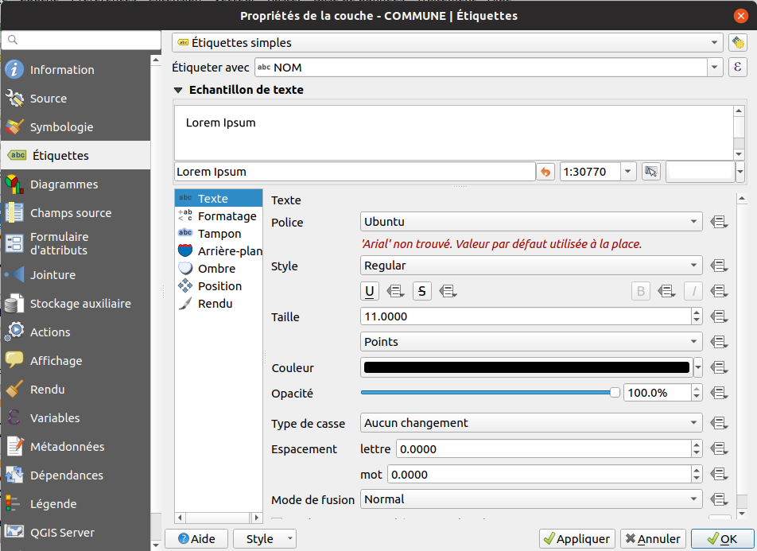
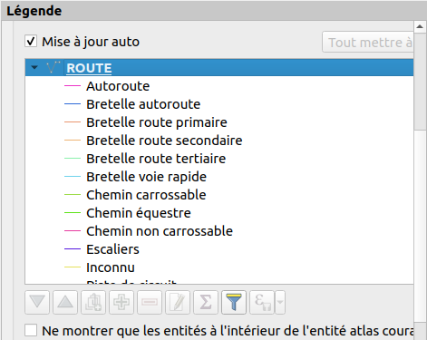

# Formation QGIS

## Pré-requis

Cette formation concerne des utilisateurs ayant des connaissance en SIG et qui souhaitent apprendre à utiliser QGIS :

* Découverte de l'interface de QGIS
* Ouverture d'une couche vecteur
* Symbologie vecteur
* Étiquetage
* Requêtage simple sur une couche vecteur
* Mise en page d'une carte pour un export PDF

Nous allons réaliser une carte communale présentant :

* les limites de communes
* les principaux axes de communication
* l'occupation du sol

Le PDF devra contenir : 

* un titre
* la carte
* une légende
* une flèche Nord
* une échelle
* les sources

Pour suivre la formation, il faut:

* Avoir QGIS 3.4 minimum
* Avoir un jeu de données, par exemple:
    * Données OSM à l'aide du plugin QuickOSM
    * Données [OSM2Igeo](https://github.com/igeofr/osm2igeo) (utilisation de ce jeu de données ci-après dans la formation)

## Interface de QGIS

## Ouverture d'une couche vecteur

* À l'aide de l'icône `plus` dans la barre d'outil ci-dessus `Source de données`, ajoutons une couche `Vecteur` de type `Fichier`. 
    * `201909_11_ILE_DE_FRANCE_SHP_L93_2154 / H_OSM_ADMINISTRATIF / COMMUNE.shp`
* *Pour info*, dans les barres d'outils, les étoiles jaunes signifient la création de nouvelle couche. 
Dans notre cas, nous souhaitons donc bien l'ajout d'une couche existante.
* Enregistrer le projet `Projet` -> `Enregistrer sous...` et mettez le **à côté** du dossier `201909_11_ILE_DE_FRANCE_SHP_L93_2154`.
* Désormais, l'aide du panneau `Explorateur`, dans `Dossier du projet` :
    * Charger `D_OSM_HYDROGRAPHIE`, `RESERVOIR_EAU.shp`
    * Charger `A_OSM_RESEAU_ROUTIER`, `ROUTE.shp`

## Requêtage simple sur une couche vecteur

* La couche commune comportent de nombreuses entités. On peut le voir graphiquement sur le canevas de la carte, 
mais aussi en ouvrant sa table attributaire.

* Pensez-bien à sélectionner votre couche dans la légende. Cela active ou non les actions dans la barre d'outils ci-dessus.
* À l'aide de l'outil `Identifier les entités` dans la barre d'outils, faire un clic sur une entité.
    * Un nouveau panneau s'ouvre présentant les résultats.
* Depuis cette barre d'outils, ouvrir la `table attributaire`.
* *Pour info*, le jaune dans les icônes représentent très souvent la notion de sélection dans QGIS.
* Utilisons l'outil de sélection à l'aide de la souris et affichons les entités sélectionnées dans la table.
* Utilisons l'icône avec un carré jaune et un epsilon (le `ε`) afin de construire une expression de sélection.
    * Cette icône se trouve dans la barre d'outils ci-dessus de la fenêtre principale
    * ou dans la nouvelle fenêtre de la table attributaire.

* On souhaite pouvoir sélectionner le(s) entité(s) qui répondent au critère `"CODE_INSEE" = '77251'`, pour cela utiliser 
l'interface graphique afin de construire la requête. Que remarquons-nous sur la structure de l'expression ?
    * Les nom des champs sont entre `""`
    * Les chaînes de caractères dans les cellules sont entre `''`.
* On souhaite désormais toutes les communes dont :
    * le code INSEE commence par `77` à l'aide de l'opérateur `like` :
        * Le pourcentage permet de faire un caractère "joker" remplacant n'importe quelle chaîne de caractères
        * Solution : `"CODE_INSEE" like '77%'`
    * la population est inférieur à 1000 habitants : 
        * Les populations sont au format texte et non nombre entier : `to_int`
        * Solution : `to_int( "POPUL" ) < 1000`

## Enregistrer le résultat d'une sélection en tant que nouvelle couche

* On peut enregistrer la sélection de la commune dans une nouvelle couche de données en faisant un clic-droit sur la couche puis `Exporter`.
* Choisir un format pour l'export, par exemple `ESRI Shapefile`. On peut aussi choisir de faire une reprojection des données.

**Attention**, dans la fenêtre pour exporter les entités, **toujours** utiliser les trois petits points lors de la saisie du nom de fichier !

## Symbologie vecteur

### Les types de symbologies

* On accède aux propriétés de la couche vecteur en faisant un double clic dans la légende, 
ou alors un clic-droit dans la légende, puis sur `Propriétés`.
* QGIS propose plusieurs onglets, rendons nous dans `Symbologie`.

Le premier menu déroulant propose le type de symbologie : 

* Aucun symbole
* Symbole unique : un seul et même symbole pour chacune des entités.
* Catégorisé : un symbole pour chaque valeur unique d'un champ particulier. Il faut un champ ayant un ensemble fini de valeur.
Par exemple, le type d'une route, il s'agit de quelques valeurs : `Autoroute`, `National`, `Départemental`, `Communale`, `Piste forestière`.
* Gradué : Contrairement à la méthode catégorisé, il s'agit ici une liste de valeurs non définies, discrètes. 
Par exemple, une population, il n'existe pas une liste de valeurs connues à l'avance, la population peut-être de 20, 784, 12600 ou encore 230 000 habitants.
* Ensemble de règles
* Polygones inversés (*polygones seulement*) : pour inverser géométriquement les polygones. Il s'agit d'un cas un peu particulier.
* 2.5D (*polygones seulement*) : donner un effet de 3D à des bâtiments.

### Faire notre style

* Pour la couche communes, nous allons appliquer : 
    * un `symbole unique`
    * `Couleur de remplissage`, mettre transparent.
* Pour la couche routes:
    * une `catégorisation` sur le champ `NATURE`
    * cliquer sur `classer` pour créer la classification
    * double-cliquer dans la colone `Symbole` ayant un fort trafic :
    * choisir le style `topo_main_road`

## Étiquetage

* Les étiquettes sont utilisées pour afficher du texte sur la carte : le nom des rues, afficher la superficie d'une commune etc.

* Nous allons faire un étiquetage simple sur la couche `communes` :
    * Se rendre dans l'onglet `Étiquettes` dans les propriétés de la couche vecteur : 

* Choisir : 
    * `Étiquettes simples`
    * `Étiquetter avec` le nom du champ que l'on souhaite afficher.
* Choisir une taille de police adaptée
* Ajouter une petite zone tampon (un liséré blanc)
* Définir des seuils de visibilités dans l'onglet `Rendu`.
    
* **Bonus**, afficher une information calculée à la volée, comme la superficie de la commune en km² : 
    * La superficie en anglais se dit `area`.
    * La projection de la couche est actuellement en m².
    * Solution partielle `$area / 1000000`
    * Solution finale `concat("NOM", ' ', round($area / 1000000, 2), ' km²')`

## Outil d'analyse vecteur

* QGIS propose de nombreux algorithmes d'analyse spatiale. 
* Nous allons utiliser l'algorithme `Extraire par localisation`/`Sélection par localisation` afin de récupérer seulement les troncons de route qui `intersectent` la commune.

## Mise en page d'une carte pour un export PDF

* Une `Mise en page` dans QGIS consiste faire une carte en respectant les règles cartographiques puis de faire un export PDF.
* Le PDF devra contenir : 
    * un titre
    * la carte
    * une légende 
    * une flèche Nord
    * une échelle
    * les sources
* `Projet` -> `Nouvelle mise en page`

### L'interface d'une mise en page

### Ajoutons les éléments de notre mise en page

*Note*, si vous le souhaitez, vous pouvez ouvrir le projet `X_PROJET_V3.qgs.qgz` pour obtenir plusieurs couches avec une symbologie. 

* Ajoutons les éléments : 
    * Une étiquette avec le titre de la carte. La modification du texte se fait dans les propriétés de l'étiquette.
    * Une autre étiquette avec les sources cartographiques de notre carte.
    * Une carte
    * Une légende : 
        * on peut filtrer la légende en cliquant sur le `filtre bleu` dans l'onglet `élément de la légende (image ci-dessous)
    * Une échelle
    * Une flèche Nord, il s'agit d'une image simple, pour laquelle on va utiliser 
    `Rechercher dans les répertoires`, dans ses propriétés, pour trouver une image adéquate)

* Nous pouvons finaliser la carte en faisant un export PDF.
    