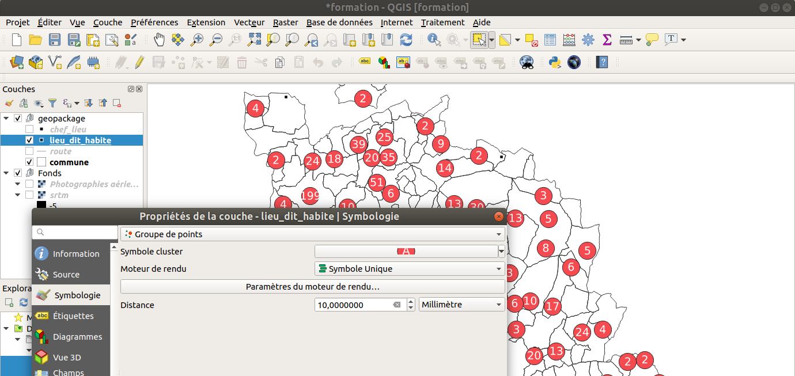
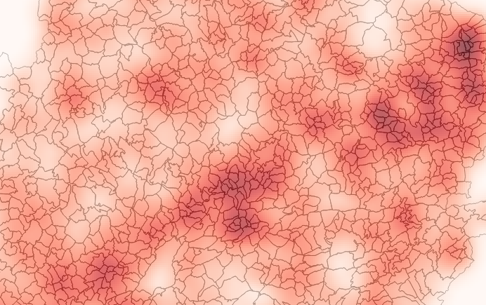
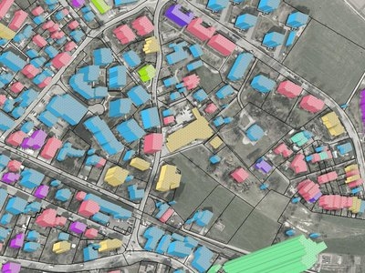
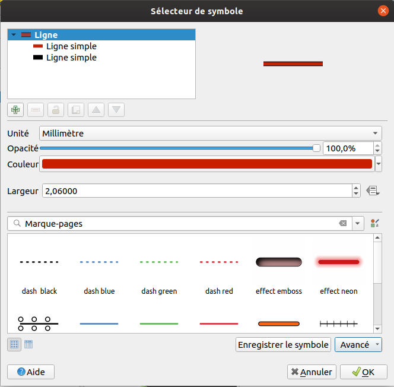
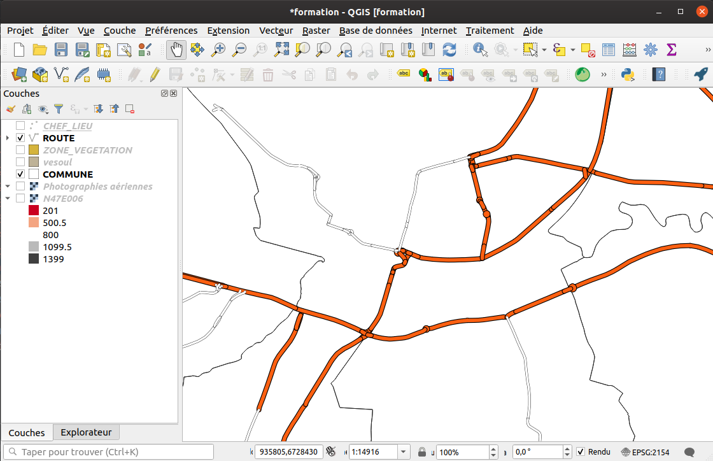
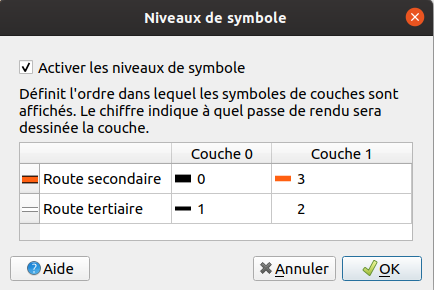
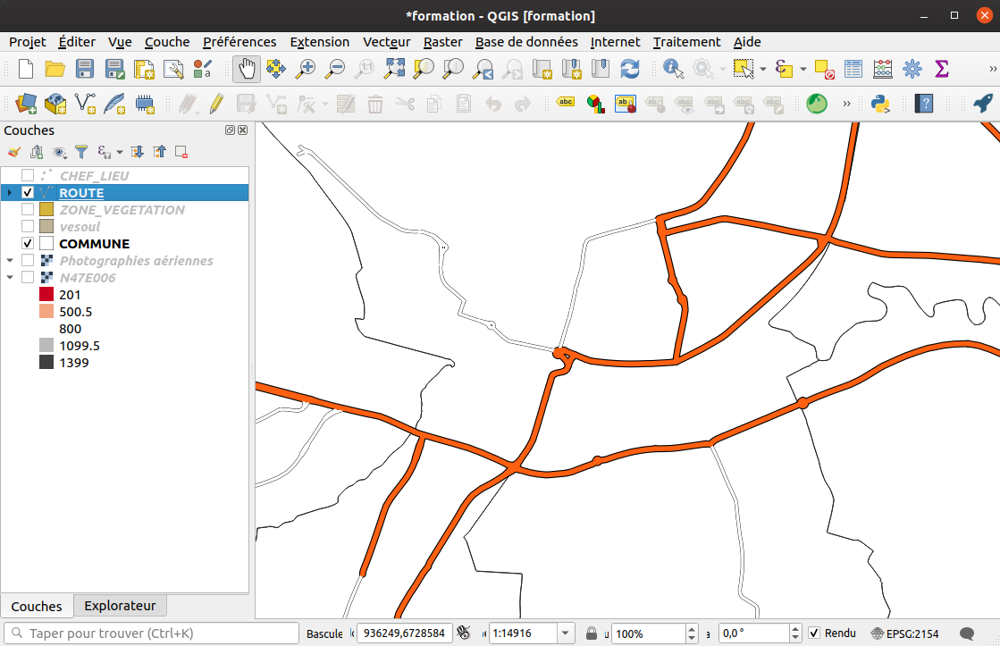
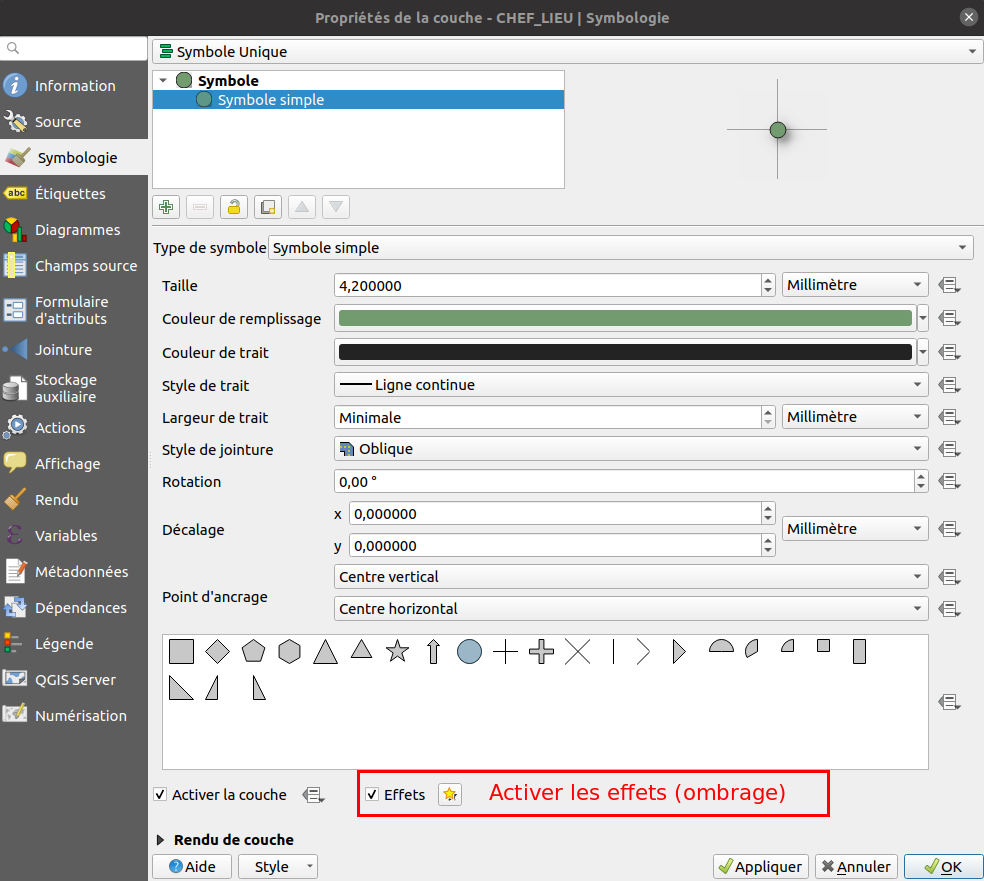

---
Title: Symbologie vecteur
Favicon: logo.png
Sibling: yes
...

[TOC]

# La symbologie vecteur

## Les différents types de symbologie

QGIS propose plusieurs modes pour appliquer une symbologie sur une couche vectorielle, suivant la géométrie :

* **Symbole unique** : tous les objets de la couche seront représentés de la même manière

* **Catégorisé** : Un champ ou une expression sert de catégorie. On aura autant de classes de symbole que de valeurs distinctes
dans cette colonne. Exemple la catégorie d'une route, on a un ensemble déterminé de valeurs : autoroute, départementale, piste forestière...

* **Graduée** : on crée des classes avec des bornes min et max sur un champ ou une expression. Tous les objets dont la valeur
est comprise entre ces bornes auront le même symbole. Exemple la population d'une commune, il y a autant de valeurs possibles que de communes.
On ne peut pas connaître à l'avance les différentes valeurs du champ. Pour la réalisation de ces bornes, il existe plusieurs modes : 
    * Intervalle égale
    * Quantile (nombre égale)
    * Ruptures naturelles (jenks). Les bornes de classes sont identifiées parmi celles qui regroupent le mieux des valeurs similaires et optimisent les différences entre les classes. Les entités sont réparties en classes dont les limites sont définies aux endroits où se trouvent de grandes différences dans les valeurs de données. 
    * Écart-type
    * Jolies ruptures
    * Documentation : http://www.geoinformations.developpement-durable.gouv.fr/fichier/pdf/m02_analyses_thematiques_papier_cle69c733.pdf?arg=177831151&cle=789472d4c4713fd4bf639930749a8c14a501ee5e&file=pdf%2Fm02_analyses_thematiques_papier_cle69c733.pdf
    
* **Ensemble de règles** : on crée un arbre de règles en utilisant des filtres sur les champs et/ou des seuils d'échelles.

* **Déplacement de points** : QGIS déplace les symboles dans un cercle ou une grille autour des points superposés

* **Groupes de points** on groupe les points dans des cercles dont l'affichage dépend du nombre de points ou d'une expresssion

* **Cartes de chaleur** on crée un raster issu de l'interpolation des valeurs des points

* **Polygones inversés**: On représente le remplissage du polygone à son extérieur (effet de masque)

* **2.5D**: Rendu pseudo-3D avec effet de perspective

Groupe de points : 

Carte de chaleur :

Rendu 2.5D :

## Les différents niveaux d'un symbole

QGIS permet de dessiner plusieurs niveaux de "dessin" pour un même symbole.

### Jouer avec l'ordre des niveaux des symboles

En affectant un style, aux routes secondaires et tertiaires, on s'aperçoit que le rendu n'est pas optimal : 

Il faut pour cela changer l'ordre de rendu des niveaux de symbole.

Retourner dans l'onglet `Symbologie`, en bas à droite, `Avancé`, `Niveaux de symbole`.

Le résultat est bien meilleur :

## Activer un effet sur un symbole

QGIS permet d'activer des effets qui sont appliqués pour modifier le symbole finale.
On peut par exemple appliquer un ombrage sur les symboles ponctuels.

